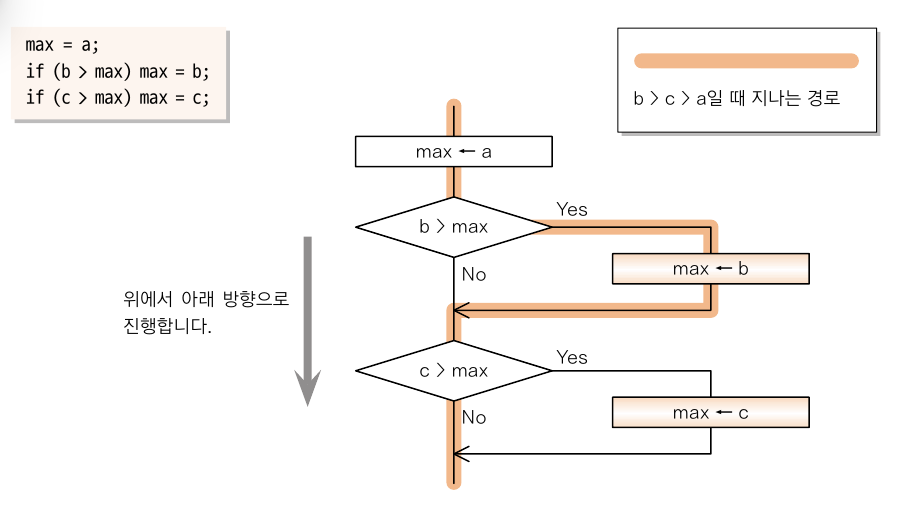
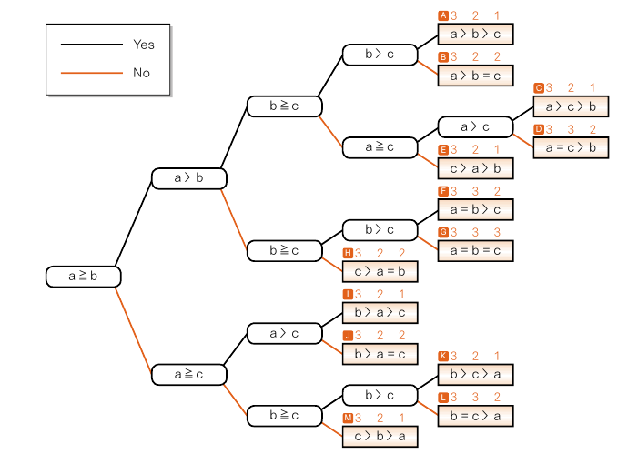
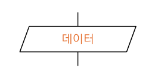
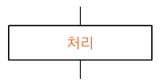
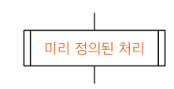
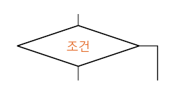
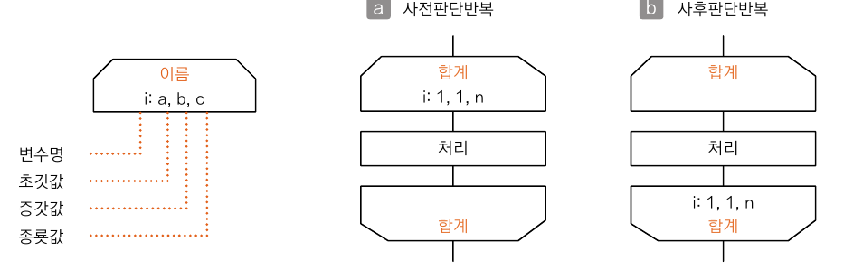
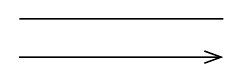
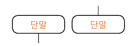

# 기본 알고리즘

## 01-1 알고리즘이란?

### 세 값의 최댓값 구하기
- 세 값의 최댓값,최솟값 구하기
- [Max3,Min3 실습](../src/ch01/MaxMinMethod.java)
- 여러 문장(프로세스)이 순차적으로 실행되는 구조를 순차구조라고 한다.
- 프로그램의 실행 흐름을 변경하는 if문을 선택구조라고 한다.
- 세 값의 최댓값을 구하는 알고리즘의 순서도
- 

- 세 값 a,b,c의 대소 관계를 나열한 결정 트리
- 
- [Median 실습](../src/ch01/MedianMethod.java)

### 순서도의 기호
- 프로그램의 순서도
  - 실제로 실행할 연산을 나타내는 기호
  - 제어 흐름을 나타내는 선 기호
  - 프로그램 순서도를 기억하거나 작성하는데 편리한 특수 기호

- 데이터
  - 데이터의 입력과 출력을 나타낸다.
  - 
- 처리
  - 처리는 여러 종류의 처리 기능을 나타낸다. 예를 들어 정봇값, 자료형, 위치를 바꾸도록 정의한 연산의 실행 또는 연속하는 몇 가지 흐름 가운데 하나의 방향을 결정하는 연산의 실행을 나타낸다.
  - 
- 미리 정의된 처리
  - 서브루틴 및 모듈 등 다른 곳에서 이미 정의된 하나 이상의 연산 또는 여러 개의 명령어로 이루어진 처리를 나타낸다.
  - 
- 판단
  - 하나의 입구와 하나를 선택하는 몇 개의 출구가 있고, 기호에서 정의한 조건을 평가하여 하나의 출구를 선택하는 판단 기능을 나타낸다.
  - 
- 루프 범위
  - 두 부분으로 구성되어 루프의 시작과 종료를 나타낸다.
  - 
- 선
  - 제어의 흐름을 나타낸다.
  - 
- 단말
  - 외부 환경으로 나가거나 외부 환경에서 들어오는 것을 나타낸다.
  - 

## 01-2 반복

- while 문 반복
- for 문 반복 
- 가우스의 덧셈 (a + b) * (b - a + 1) * 1/2
- 드모르간 법칙 
  - 각 조건을 부정하고 논리곱을 논리합으로, 논리합을 논리곱으로 바꾸고 다시 전체를 부정하면, 원래의 조건과 같다.
- [피라미드 출력 실습](../src/ch01/TriangleMethod.java)