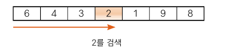
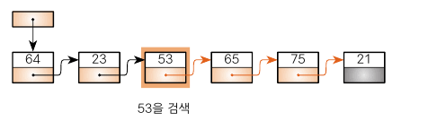
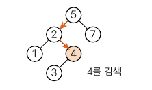

# 검색 알고리즘

## 03-1 검색 알고리즘이란?
- 데이터 집합에서 원하는 값을 가진 요소를 찾아내는 것

### 검색과 키 살펴보기
- 주목하는 항목을 키라고 한다.
  - 국적 검색시에는 국적이 키이며, 나이 검색시에는 나이가 키이다.
  - 대부분의 경우 키는 데이터의 일부이다.
### 배열에서 검색하기
- 배열에서 검색
- 
  1. 선형 검색: 무작위로 늘어서 있는 데이터 모임에서 검색을 수행
  2. 이진 검색 : 일정한 규칙으로 늘어서 있는 데이터 모임에서 아주 빠른 검색을 수행
  3. 해시법: 추가, 삭제가 자주 일어나는 데이터 모임에서 아주 빠른 검색을 수행
    - 체인법 : 같은 해시값의 데이터를 선형 리스트로 연결하는 방법
    - 오픈 주소법 : 데이터를 위한 해시값이 충돌할 때 재해시하는 방법
- 선형 리스트에서 검색

- 이진검색트리에서 검색

## 03-2 선형 검색
- 가장 기본적인 알고리즘

### 선형 검색 알아보기
- 원하는 키값을 갖는 요소를 만날 때까지 맨 앞부터 순서대로 요소를 검색 <- 선형 검색 또는 순차 검색
- 배열의 요솟수가 n개 일때 종료 조건을 판단하는 횟수는 평균 n / 2 회
- [3-1 ,3-2실습](../src/ch03/SeqSearch.java)

### 보초법으로 선형 검색 구현하기
- 선형 검색은 반복할 때마다 다음의 종료 조건은 모두 판단한다. 종료 조건을 검사하는 비용은 결코 무시할 수 없다.
- 이 비용을 반으로 줄이는 방법이 보초법(sentinel method). 
- 검색하고자 하는 key값을 배열의 마지막 요소로 삽입.
- 보초는 반복문에서 종료 한단 횟수를 2회에서 1회로 줄이는 역할을 한다.
- [3-3 실습](../src/ch03/SeqSearchSen.java)

## 03-3 이진 검색
- 알고리즘을 적용하는 전제 조건은 데이터가 키값으로 이미 정렬되어 있다는 것.
- 선형 검색보다 좀 더 빠르게 검색할 수 있다는 장점이 있음.
- 중간 지점을 검색해서, 키값이 크보다 작으면 작은 범위의 중간을 다시, 크다면 큰 범위의 중간을 다시 검색.
- 이를 반복하여, 원하는 키값을 찾아낸다.
- 비교 회수의 평균값은 log n
- [3-4 실습](../src/ch03/SeqSearchSen.java)

### 복잡도 구하기
- 알고리즘의 성능을 객관적으로 평가하는 기준
  - 시간 복잡도 : 실행에 필요한 시간을 평가한 것
  - 공간 복잡도 : 기억 영역이나 파일 공간이 얼마나 필요한가를 평가한 것
- 선형 검색의 시간 복잡도
  - O(n)
- 이진 검색의 시간 복잡도
  - O(log n)  

### Arrays.binarySearch에 의한 이진 검색
- 자바는 배열에서 이진 검색을 하는 메서드를 표준 라이브러리로 제공한다.
- key와 일치하는 요소의 인덱스를 반환한다. key와 일치하는 요소가 여러 개 있을 경우 어느 요소의 인덱스를 반환하는지는 정해지지 않음.
- 검색에 실패했을 경우에는 key가 있어야할 위치를 추정할수 있는 값을 반환. 삽입 포인트를 x라고 할 때 반환 값은 -x-1
- [실습 3-5](../src/ch03/BinarySearchTester.java)
- 객체의 대소 관계를 판단하는 comparator를 사용자가 직접 구현
  - Comparator 인터페이스를 구현한 클래스를 정의하고 그 클래스형의 인스턴스를 생성
  - 그리고 아래와 같은 compare 메서드 구현
    - 첫 번째 인수가 더 크면 양수
    - 첫 번째 인수가 더 작으면 음수
    - 첫 번재 인수와 두 번째 인수가 같으면 0
- [실습 3-8]()