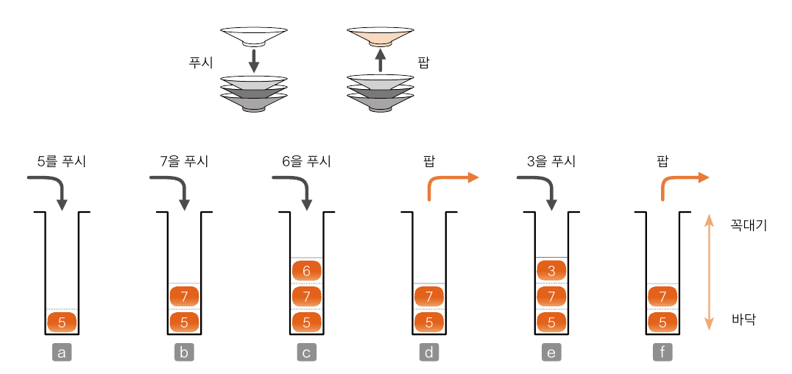
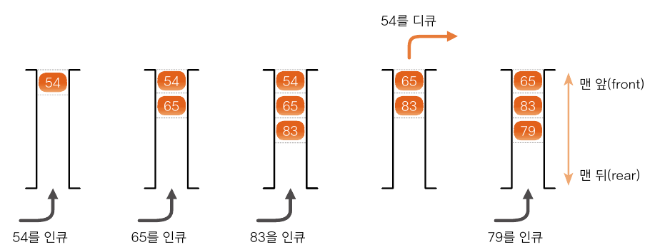

# 스택과 큐

## 04-1 스택이란?
- 데이터를 일시적으로 쌓아놓는 구조
- 데이터의 입력과 출력 순서는 후입선출(LIFO : Last In First Out) : 가장 나중에 넣은 데이터를 가장 먼저 꺼낸다.
- 데이터를 넣는 작업을 push라고 하며 데이터를 꺼내는 작업을 pop이라고 한다.

- 자바 프로그램에서 메서드를 호출하고 실행할 때 프로그램 내부에서 스택을 사용한다.
- 스택만들기
  - [4-1 실습](../src/ch04/IntStack.java)

## 04-2 큐란?
- 데이터를 일시적으로 쌓아놓는 구조
- 선입선출(FIFO : First In First Out) 가장 먼저 넣은 데이터를 가장 먼저 꺼냄

- 큐에 데이터를 넣는 작업을 인큐, 꺼내는 작업을 디큐
- 데이터가 나오는 쪽을 프런트, 넣는 쪽을 리어
- 링 버퍼로 큐 만들기