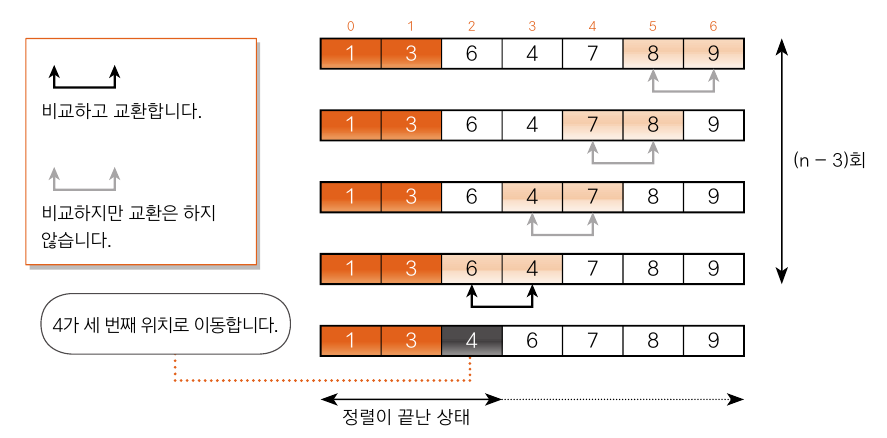
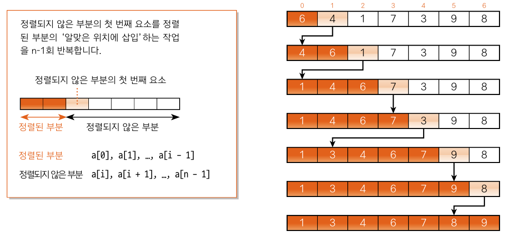

# 정렬 알고리즘

## 06-1 정렬 알고리즘이란?

### 정렬이란?

> 이름, 학번,키 등 key의 대소 관계에 따라 데이터 집합을 일정한 순서로 나열하는 작업
> 
> 오름 차순 : 값이 작은 데이터를 앞에 배치
> 
> 내림 차순 : 값이 큰 데이터를 앞에 배치

#### 정렬 알고리즘의 안정성

1. 안정된 정렬 
    - 키값이 같은 요소의 순서가 정렬 전후에도 유지됨
2. 안정되지 않은 정렬
    - 키값이 같은 요소의 순서의 정렬을 보장할 수 없음

#### 내부 정렬과 외부 정렬
1. 내부 정렬
   - 정렬할 모든 데이터를 하나의 배열에 저장할 수 있을 때에 사용
2. 외부 정렬
   - 정렬할 데이터가 너무 많아서 하나의 배열에 저장할 수 없을 때에 사용

#### 정렬 알고리즘의 핵심요소
- <span style="color:brown">교환</span>
- <span style="color:yellowgreen">선택</span>
- <span style="color:violet">삽입</span>
---

## 06-2 버블 정렬

> 이웃한 두 요소의 대소 관계를 비교하고 필요에 따라 교환을 반복하는 알고리즘

### 버블 정렬 알아보기

<table>
    <thead>
        <tr>
            <th style="background-color: white; color: black;">6</th>
            <th style="background-color: white; color: black;">4</th>
            <th style="background-color: white; color: black;">3</th>
            <th style="background-color: white; color: black;">7</th>
            <th style="background-color: white; color: black;">1</th>
            <th style="background-color: lightpink; color: black;">9</th>
            <th style="background-color: lightpink; color: black;">8</th>
        </tr>
    </thead>
</table>

먼저 끝에 있는 두 요소 9와 8부터 시작.
오름 차순으로 정렬을  위해서는 왼쪽 값이 오른 쪽 보다 작아야 한다.

따라서 9와 8을 교환한 배열은 다음 과 같다.

<table>
    <thead>
        <tr>
            <th style="background-color: white; color: black;">6</th>
            <th style="background-color: white; color: black;">4</th>
            <th style="background-color: white; color: black;">3</th>
            <th style="background-color: white; color: black;">7</th>
            <th style="background-color: lightpink; color: black;">1</th>
            <th style="background-color: lightpink; color: black;">8</th>
            <th style="background-color: white; color: black;">9</th>
        </tr>
    </thead>
</table>

그 이후 두 번째와 세 번째 요소인 1과 8을 비교한다. 1은 8보다 작으므로 교환할 필요가 없다.

이렇게 이웃한 요소를 비교하고 교환하는 작업을 첫 번째 요소까지 반복한 결과는

<table>
    <thead>
        <tr>
            <th style="background-color: lightgray; color: black;">1</th>
            <th style="background-color: white; color: black;">6</th>
            <th style="background-color: white; color: black;">4</th>
            <th style="background-color: white; color: black;">3</th>
            <th style="background-color: white; color: black;">7</th>
            <th style="background-color: white; color: black;">8</th>
            <th style="background-color: white; color: black;">9</th>
        </tr>
    </thead>
</table>

n - 1번 비교, 교환 하고 나면 가장 작은 요소가 맨 처음으로 이동한다. 이런 일련의 과정(비교, 교환)을 패스(pass)라고 한다.

이어서 배열의 두 번째 이후 요소를 비교, 교환하는 패스를 수행한다.
<table>
    <thead>
        <tr>
            <th style="background-color: lightskyblue; color: black;">1</th>
            <th style="background-color: white; color: black;">6</th>
            <th style="background-color: white; color: black;">4</th>
            <th style="background-color: white; color: black;">3</th>
            <th style="background-color: white; color: black;">7</th>
            <th style="background-color: lightpink; color: black;">8</th>
            <th style="background-color: lightpink; color: black;">9</th>
        </tr>
    </thead>
</table>

<table>
    <thead>
        <tr>
            <th style="background-color: lightskyblue; color: black;">1</th>
            <th style="background-color: white; color: black;">6</th>
            <th style="background-color: white; color: black;">4</th>
            <th style="background-color: white; color: black;">3</th>
            <th style="background-color: lightpink; color: black;">7</th>
            <th style="background-color: lightpink; color: black;">8</th>
            <th style="background-color: white; color: black;">9</th>
        </tr>
    </thead>
</table>

...
<table>
    <thead>
        <tr>
            <th style="background-color: lightskyblue; color: black;">1</th>
            <th style="background-color: lightgray; color: black;">3</th>
            <th style="background-color: white; color: black;">6</th>
            <th style="background-color: white; color: black;">4</th>
            <th style="background-color: white; color: black;">7</th>
            <th style="background-color: white; color: black;">8</th>
            <th style="background-color: white; color: black;">9</th>
        </tr>
    </thead>
</table>

이 수행 이후 3은 배열의 두 번째 자리로 이동하고 두 요소의 정렬이 끄난다.
두 번째 패스의 비교 횟수는 첫 번째 패스보다 1번 적은 n -2번

패스를 k번 수행하면 앞쪽부터 k개의 요소가 정렬된다.
모든 정렬이 끝나기 위해서는 패스가 <span style="color:yellowgreen">n - 1</span>번 수행되어야 한다.

#### 버블 정렬 프로그램 만들기

버블 정렬 알고리즘은 안정적이다.

>모든 패스의 비교 횟수의 합
> 
> (n - 1) + (n - 2) + ... + 1 = n(n-1) / 2

> 교환 횟수의 평균
>
> 절반인 n(n -1) / 4회

> 이동 횟수의 평균
> 
> 3n(n -1) / 4회

[실습 6-1](../src/ch06/BubbleSort.java)

#### 알고리즘 개선하기 1

> 배열이 정렬을 이미 마친 상태라면 그 이후의 패스 요소는 교환 하지 않는다.
> 



위의 세 번째 패스가 종료되고, 네 번째 패스에서는 단 한 번도 교환이 일어나지 않는다.
다섯 번째와 여섯 번째 패스도 마찬가지.

즉, 어떤 패스에서 요소의 교환 횟수가 0번이면 더 이상 정렬할 요소가 없다는 뜻.

[실습 6-2](../src/ch06/BubbleSort2.java)

### 알고리즘 개선하기 2

각 패스에서 비교, 교환을 시도하다가 어느 시점부터 교환이 일어나지 않는다면, 그보다 앞쪽 요소는 이미 정렬을 마친 상태라고 판단.

[실습 6-3](../src/ch06/BubbleSort3.java)

## 06-3 단순 선택 정렬

> 가장 작은 요소를 맨 앞으로 이동하고, 두 번째 작은 요소는 맨 앞에서 두 번째로 이동하는 등의 작업을 반복하는 알고리즘

### 단순 선택 정렬 알아보기

가장 작은 요소부터 정렬하므로 가장 작은 요소인 1을 선택해 정렬을 시작

<table>
    <thead>
        <tr>
            <th style="background-color: lightgray; color: black;">6</th>
            <th style="background-color: white; color: black;">4</th>
            <th style="background-color: white; color: black;">8</th>
            <th style="background-color: white; color: black;">3</th>
            <th style="background-color: lightpink; color: black;">1</th>
            <th style="background-color: white; color: black;">9</th>
            <th style="background-color: white; color: black;">7</th>
        </tr>
    </thead>
</table>

1을 6과 교환. 교환한 다음의 상태
<table>
    <thead>
        <tr>
            <th style="background-color: lightpink; color: black;">1</th>
            <th style="background-color: white; color: black;">4</th>
            <th style="background-color: white; color: black;">8</th>
            <th style="background-color: white; color: black;">3</th>
            <th style="background-color: lightgrey; color: black;">6</th>
            <th style="background-color: white; color: black;">9</th>
            <th style="background-color: white; color: black;">7</th>
        </tr>
    </thead>
</table>

이어서 두 번째로 작은 요소인 3을 선택해 정렬

아직 정렬하지 않은 부분에서 값이 가장 작은 요소를 택하고, 아직 정렬하지 않은 부분의 첫 번째 요소와 교환

교환 과정은 다음과 같다.
>1. 아직 정렬하지 않은 부분에서 가장 작은 키값(a[min])을 선택
>2. a[min]과 아직 정렬하지 않은 부분의 첫 번째 요소를 교환

이 과정을 n - 1번 반복

[실습 6-4](../src/ch06/SelectionSort.java)

> 요솟값 비교 횟수
>  > (n^2 -n) /2번
> 
> 단순 선택 정렬 알고리즘은 안정적이지 못 하다.
> 

### 6-4 단순 삽입 정렬
> 선택한 요소를 그보다 앞쪽의 알맞은 위치에 '삽입'하는 작업을 반복하여 정렬하는 알고리즘
> 

#### 단순 삽입 정렬 알아보기

<table>
    <thead>
        <tr>
            <th style="background-color: white; color: black;">6</th>
            <th style="background-color: lightpink; color: black;">4</th>
            <th style="background-color: white; color: black;">1</th>
            <th style="background-color: white; color: black;">7</th>
            <th style="background-color: white; color: black;">3</th>
            <th style="background-color: white; color: black;">9</th>
            <th style="background-color: white; color: black;">8</th>
        </tr>
    </thead>
</table>

단순 삽입 정렬은 두 번째 요소부터 선택하여 진행.
이 때 4는 6보다 앞쪽에 위치해야 하므로 앞쪽에 삽입.
이에 따라 6을 오른쪽으로 옮기면 다음처럼 됨.

<table>
    <thead>
        <tr>
            <th style="background-color: lightpink; color: black;">4</th>
            <th style="background-color: white; color: black;">6</th>
            <th style="background-color: white; color: black;">1</th>
            <th style="background-color: white; color: black;">7</th>
            <th style="background-color: white; color: black;">3</th>
            <th style="background-color: white; color: black;">9</th>
            <th style="background-color: white; color: black;">8</th>
        </tr>
    </thead>
</table>

다음 작업을 n - 1회 반복하면 정렬이 종료됨.

> 아직 정렬되지 않은 부분의 첫 번째 요소를 정렬한 부분의 알맞은 위치에 삽입한다.



자바에서의 삽입 구현
```java
j = i;
temp = a[i];
while(j > 0 && a[j - 1] > temp){
    a[j] = a[j - 1];
    j--
}
a[j] = temp;
```

while 문이 끝나는 두 조건
>1. 정렬된 열의 왼쪽 끝에 도달합니다.
>2. temp보다 작거나 같은 key를 갖는 항목a[j-1]을 발견합니다.

즉 while 문의 조건
> j가 0보다 크다.
> a[j-1]값이 temp보다 크다.


#### 단순 정렬의 시간 복잡도
현재까지 공부한 세 가지 단순 정렬(버블,선택,삽입)의 시간 복잡도는 모두 O(n^2)이다.

## 06-5 셸 정렬

### 단순 삽입 정렬의 특징 살펴보기

>1. 정렬이 되었거나 또는 그 상태에 가까우면 정렬 속도가 아주 빠르다.(장점)
>2. 삽입할 곳이 멀리 떨어지면 이동(대입)하는 횟수가 많다.(단점)

#### 셸 정렬 알아보기

> 일정한 간격으로 서로 떨어져 있는 두 요소를 그룹으로 묶어 대략 정렬을 수행하고, 그 간격을 좁혀 그룹의 수를 줄이면서 정렬을 반복하여 요소의 이동 횟수를 줄이는 방법