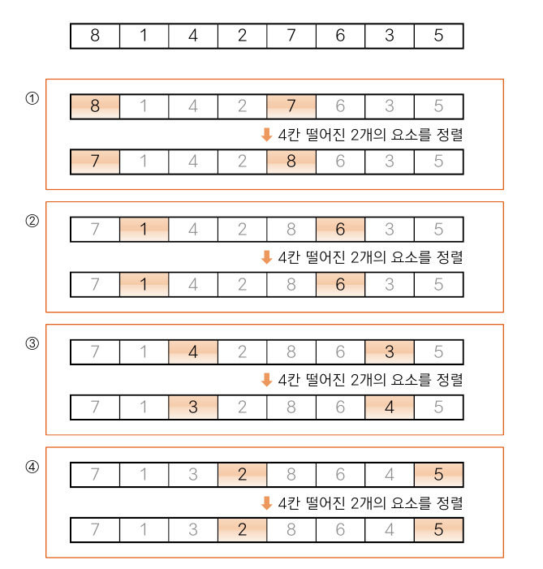
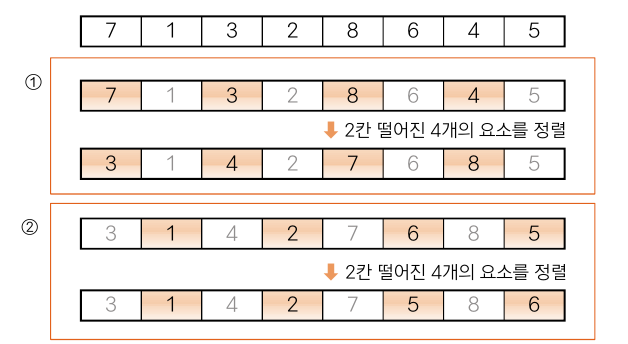
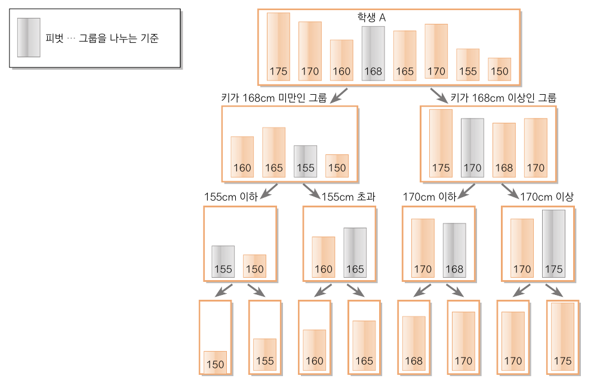
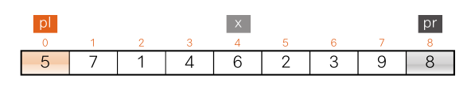
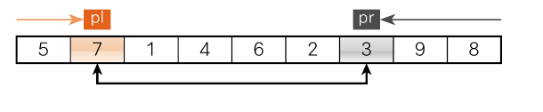
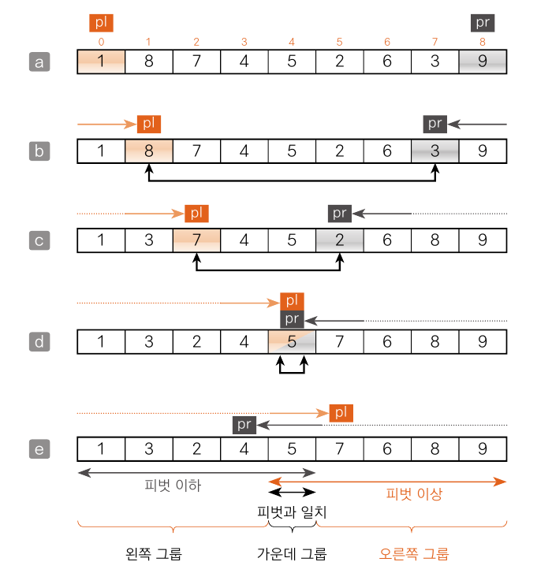
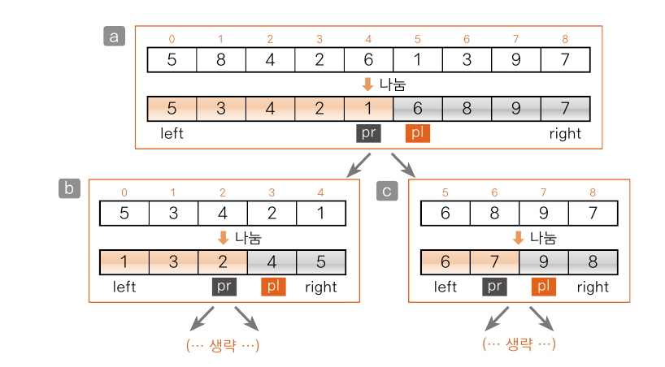
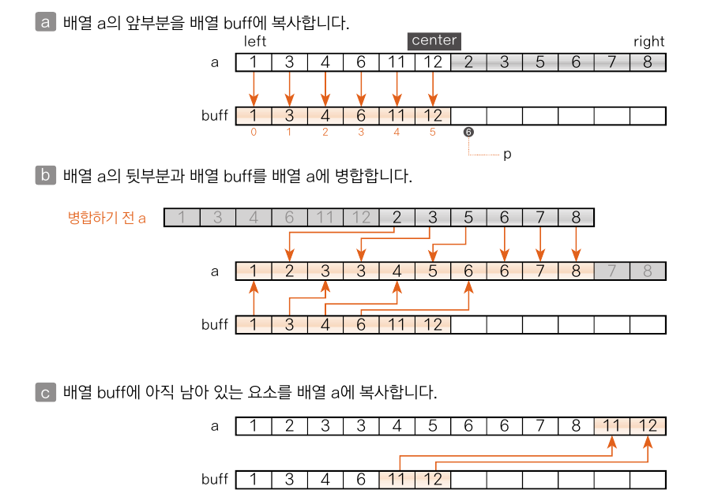
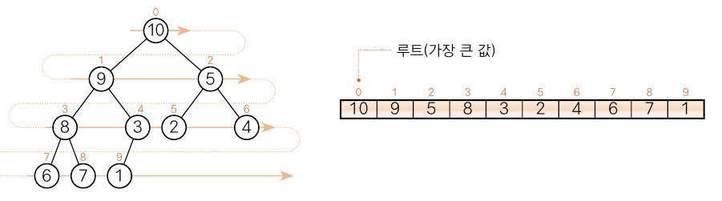

# 정렬 알고리즘

## 06-1 정렬 알고리즘이란?

### 정렬이란?

> 이름, 학번,키 등 key의 대소 관계에 따라 데이터 집합을 일정한 순서로 나열하는 작업
> 
> 오름 차순 : 값이 작은 데이터를 앞에 배치
> 
> 내림 차순 : 값이 큰 데이터를 앞에 배치

#### 정렬 알고리즘의 안정성

1. 안정된 정렬 
    - 키값이 같은 요소의 순서가 정렬 전후에도 유지됨
2. 안정되지 않은 정렬
    - 키값이 같은 요소의 순서의 정렬을 보장할 수 없음

#### 내부 정렬과 외부 정렬
1. 내부 정렬
   - 정렬할 모든 데이터를 하나의 배열에 저장할 수 있을 때에 사용
2. 외부 정렬
   - 정렬할 데이터가 너무 많아서 하나의 배열에 저장할 수 없을 때에 사용

#### 정렬 알고리즘의 핵심요소
- <span style="color:brown">교환</span>
- <span style="color:yellowgreen">선택</span>
- <span style="color:violet">삽입</span>
---

## 06-2 버블 정렬

> 이웃한 두 요소의 대소 관계를 비교하고 필요에 따라 교환을 반복하는 알고리즘

### 버블 정렬 알아보기

<table>
    <thead>
        <tr>
            <th style="background-color: white; color: black;">6</th>
            <th style="background-color: white; color: black;">4</th>
            <th style="background-color: white; color: black;">3</th>
            <th style="background-color: white; color: black;">7</th>
            <th style="background-color: white; color: black;">1</th>
            <th style="background-color: lightpink; color: black;">9</th>
            <th style="background-color: lightpink; color: black;">8</th>
        </tr>
    </thead>
</table>

먼저 끝에 있는 두 요소 9와 8부터 시작.
오름 차순으로 정렬을  위해서는 왼쪽 값이 오른 쪽 보다 작아야 한다.

따라서 9와 8을 교환한 배열은 다음 과 같다.

<table>
    <thead>
        <tr>
            <th style="background-color: white; color: black;">6</th>
            <th style="background-color: white; color: black;">4</th>
            <th style="background-color: white; color: black;">3</th>
            <th style="background-color: white; color: black;">7</th>
            <th style="background-color: lightpink; color: black;">1</th>
            <th style="background-color: lightpink; color: black;">8</th>
            <th style="background-color: white; color: black;">9</th>
        </tr>
    </thead>
</table>

그 이후 두 번째와 세 번째 요소인 1과 8을 비교한다. 1은 8보다 작으므로 교환할 필요가 없다.

이렇게 이웃한 요소를 비교하고 교환하는 작업을 첫 번째 요소까지 반복한 결과는

<table>
    <thead>
        <tr>
            <th style="background-color: lightgray; color: black;">1</th>
            <th style="background-color: white; color: black;">6</th>
            <th style="background-color: white; color: black;">4</th>
            <th style="background-color: white; color: black;">3</th>
            <th style="background-color: white; color: black;">7</th>
            <th style="background-color: white; color: black;">8</th>
            <th style="background-color: white; color: black;">9</th>
        </tr>
    </thead>
</table>

n - 1번 비교, 교환 하고 나면 가장 작은 요소가 맨 처음으로 이동한다. 이런 일련의 과정(비교, 교환)을 패스(pass)라고 한다.

이어서 배열의 두 번째 이후 요소를 비교, 교환하는 패스를 수행한다.
<table>
    <thead>
        <tr>
            <th style="background-color: lightskyblue; color: black;">1</th>
            <th style="background-color: white; color: black;">6</th>
            <th style="background-color: white; color: black;">4</th>
            <th style="background-color: white; color: black;">3</th>
            <th style="background-color: white; color: black;">7</th>
            <th style="background-color: lightpink; color: black;">8</th>
            <th style="background-color: lightpink; color: black;">9</th>
        </tr>
    </thead>
</table>

<table>
    <thead>
        <tr>
            <th style="background-color: lightskyblue; color: black;">1</th>
            <th style="background-color: white; color: black;">6</th>
            <th style="background-color: white; color: black;">4</th>
            <th style="background-color: white; color: black;">3</th>
            <th style="background-color: lightpink; color: black;">7</th>
            <th style="background-color: lightpink; color: black;">8</th>
            <th style="background-color: white; color: black;">9</th>
        </tr>
    </thead>
</table>

...
<table>
    <thead>
        <tr>
            <th style="background-color: lightskyblue; color: black;">1</th>
            <th style="background-color: lightgray; color: black;">3</th>
            <th style="background-color: white; color: black;">6</th>
            <th style="background-color: white; color: black;">4</th>
            <th style="background-color: white; color: black;">7</th>
            <th style="background-color: white; color: black;">8</th>
            <th style="background-color: white; color: black;">9</th>
        </tr>
    </thead>
</table>

이 수행 이후 3은 배열의 두 번째 자리로 이동하고 두 요소의 정렬이 끄난다.
두 번째 패스의 비교 횟수는 첫 번째 패스보다 1번 적은 n -2번

패스를 k번 수행하면 앞쪽부터 k개의 요소가 정렬된다.
모든 정렬이 끝나기 위해서는 패스가 <span style="color:yellowgreen">n - 1</span>번 수행되어야 한다.

#### 버블 정렬 프로그램 만들기

버블 정렬 알고리즘은 안정적이다.

>모든 패스의 비교 횟수의 합
> 
> (n - 1) + (n - 2) + ... + 1 = n(n-1) / 2

> 교환 횟수의 평균
>
> 절반인 n(n -1) / 4회

> 이동 횟수의 평균
> 
> 3n(n -1) / 4회

[실습 6-1](../src/ch06/BubbleSort.java)

#### 알고리즘 개선하기 1

> 배열이 정렬을 이미 마친 상태라면 그 이후의 패스 요소는 교환 하지 않는다.
> 


위의 세 번째 패스가 종료되고, 네 번째 패스에서는 단 한 번도 교환이 일어나지 않는다.
다섯 번째와 여섯 번째 패스도 마찬가지.

즉, 어떤 패스에서 요소의 교환 횟수가 0번이면 더 이상 정렬할 요소가 없다는 뜻.

[실습 6-2](../src/ch06/BubbleSort2.java)

### 알고리즘 개선하기 2

각 패스에서 비교, 교환을 시도하다가 어느 시점부터 교환이 일어나지 않는다면, 그보다 앞쪽 요소는 이미 정렬을 마친 상태라고 판단.

[실습 6-3](../src/ch06/BubbleSort3.java)

## 06-3 단순 선택 정렬

> 가장 작은 요소를 맨 앞으로 이동하고, 두 번째 작은 요소는 맨 앞에서 두 번째로 이동하는 등의 작업을 반복하는 알고리즘

### 단순 선택 정렬 알아보기

가장 작은 요소부터 정렬하므로 가장 작은 요소인 1을 선택해 정렬을 시작

<table>
    <thead>
        <tr>
            <th style="background-color: lightgray; color: black;">6</th>
            <th style="background-color: white; color: black;">4</th>
            <th style="background-color: white; color: black;">8</th>
            <th style="background-color: white; color: black;">3</th>
            <th style="background-color: lightpink; color: black;">1</th>
            <th style="background-color: white; color: black;">9</th>
            <th style="background-color: white; color: black;">7</th>
        </tr>
    </thead>
</table>

1을 6과 교환. 교환한 다음의 상태
<table>
    <thead>
        <tr>
            <th style="background-color: lightpink; color: black;">1</th>
            <th style="background-color: white; color: black;">4</th>
            <th style="background-color: white; color: black;">8</th>
            <th style="background-color: white; color: black;">3</th>
            <th style="background-color: lightgrey; color: black;">6</th>
            <th style="background-color: white; color: black;">9</th>
            <th style="background-color: white; color: black;">7</th>
        </tr>
    </thead>
</table>

이어서 두 번째로 작은 요소인 3을 선택해 정렬

아직 정렬하지 않은 부분에서 값이 가장 작은 요소를 택하고, 아직 정렬하지 않은 부분의 첫 번째 요소와 교환

교환 과정은 다음과 같다.
>1. 아직 정렬하지 않은 부분에서 가장 작은 키값(a[min])을 선택
>2. a[min]과 아직 정렬하지 않은 부분의 첫 번째 요소를 교환

이 과정을 n - 1번 반복

[실습 6-4](../src/ch06/SelectionSort.java)

> 요솟값 비교 횟수
>  > (n^2 -n) /2번
> 
> 단순 선택 정렬 알고리즘은 안정적이지 못 하다.
> 

### 6-4 단순 삽입 정렬
> 선택한 요소를 그보다 앞쪽의 알맞은 위치에 '삽입'하는 작업을 반복하여 정렬하는 알고리즘
> 

#### 단순 삽입 정렬 알아보기

<table>
    <thead>
        <tr>
            <th style="background-color: white; color: black;">6</th>
            <th style="background-color: lightpink; color: black;">4</th>
            <th style="background-color: white; color: black;">1</th>
            <th style="background-color: white; color: black;">7</th>
            <th style="background-color: white; color: black;">3</th>
            <th style="background-color: white; color: black;">9</th>
            <th style="background-color: white; color: black;">8</th>
        </tr>
    </thead>
</table>

단순 삽입 정렬은 두 번째 요소부터 선택하여 진행.
이 때 4는 6보다 앞쪽에 위치해야 하므로 앞쪽에 삽입.
이에 따라 6을 오른쪽으로 옮기면 다음처럼 됨.

<table>
    <thead>
        <tr>
            <th style="background-color: lightpink; color: black;">4</th>
            <th style="background-color: white; color: black;">6</th>
            <th style="background-color: white; color: black;">1</th>
            <th style="background-color: white; color: black;">7</th>
            <th style="background-color: white; color: black;">3</th>
            <th style="background-color: white; color: black;">9</th>
            <th style="background-color: white; color: black;">8</th>
        </tr>
    </thead>
</table>

다음 작업을 n - 1회 반복하면 정렬이 종료됨.

> 아직 정렬되지 않은 부분의 첫 번째 요소를 정렬한 부분의 알맞은 위치에 삽입한다.


자바에서의 삽입 구현
```java
j = i;
temp = a[i];
while(j > 0 && a[j - 1] > temp){
    a[j] = a[j - 1];
    j--
}
a[j] = temp;
```

while 문이 끝나는 두 조건
>1. 정렬된 열의 왼쪽 끝에 도달합니다.
>2. temp보다 작거나 같은 key를 갖는 항목a[j-1]을 발견합니다.

즉 while 문의 조건
> j가 0보다 크다.
> a[j-1]값이 temp보다 크다.


#### 단순 정렬의 시간 복잡도
현재까지 공부한 세 가지 단순 정렬(버블,선택,삽입)의 시간 복잡도는 모두 O(n^2)이다.

---

## 06-5 셸 정렬

### 단순 삽입 정렬의 특징 살펴보기

>1. 정렬이 되었거나 또는 그 상태에 가까우면 정렬 속도가 아주 빠르다.(장점)
>2. 삽입할 곳이 멀리 떨어지면 이동(대입)하는 횟수가 많다.(단점)

#### 셸 정렬 알아보기

>‘Donald L. Shell’이라는 사람이 제안한 방법 
> 
>일정한 간격으로 서로 떨어져 있는 두 요소를 그룹으로 묶어 대략 정렬을 수행하고, 그 간격을 좁혀 그룹의 수를 줄이면서 정렬을 반복하여 요소의 이동 횟수를 줄이는 방법
> 



4칸 떨어진 요소를 하나의 그룹으로 묶어 정렬하는 4-정렬



4-정렬을 마친 상태에서 2-정렬을 하는 과정

셸 정렬 과정에서 수행하는 각각의 정렬을 <span style="color:yellowgreen">h-정렬</span>이라고 한다.

위의 배열의 경우

>- 2개 요소에 '4-정렬'을 적용 ...4회
>- 4개 요소에 '2-정렬'을 적용 ...2회
>- 8개의 요소에 '1-정렬'을 적용 ...1회
>- 총 7회로 정렬을 마칠 수 있다.

정렬 되지 않은 배열에 단순 삽입 정렬을 곧바로 적용하는 것이 아닌 '4-정렬', '2-정렬'을 통해 조금이라도 정렬에 가까운 배열로 만들어 놓은 다음에 단순 삽입 정렬을 마지막으로 한 번 더 수행하여 정렬을 마친다.

[실습 6-6](../src/ch06/ShellSort.java)

h의 값은 서로 배수가 되지 않도록 만드는 것이 효율적이다.

[실습 6-7](../src/ch06/ShellSort2.java)

셸 정렬의 시간 복잡도는 O(n^1.25)으로, 기존의 시간 복잡도인 O(n^2)에 비해 매우 빠르다.
또한 셸 정렬은 안정적이지 않다.

## 06-6 퀵 정렬

> 가장 빠른 정렬 알고리즘 중 하나로 널리 사용되고 있음.

### 퀵 정렬 살펴보기

>알고리즘을 개발한 리처드 호어가 알고리즘의 정렬 속도가 매우 빠른 데서 착안해 직접 붙인 이름

그룹을 나누는 기준을 <span style="color:yellowgreen">피벗</span>이라고 한다. 



### 배열을 두 그룹으로 나누기

피벗을 x, 왼쪽 끝 요소의 인덱스를 pl, 오른쪽 끝 요소를 pr이라고 한다.

이 때 그룹을 나누기 위해서는 피벗 이하의 요소를 배열의 왼쪽으로, 피벗 이상의 요소를 배열 오른쪽으로 옮겨야 한다.

이를 위해 다음 작업을 수행한다.



>- arr[pl] >=x가 성립하는 요소를 찾을 때까지 pl을 오른쪽을 스캔한다.
>- arr[pr] <=x가 성립하는 요소를 찾을 때까지 pr을 왼쪽으로 스캔한다.

이 과정을 거치면 pl과 pr은 다음 그림처럼 위치하게 된다.

이때 pl이 위치한 지점은 피벗값 이상의 요소가 있는 지점이며, pr의 요소는 피벗값 이하의 요소가 있는 지점이다.
여기서 pl과 pr이 가리키는 요소 a[pl]과 a[pr]의 값을 교환한다.



이와 같은 작업을 반복하다가, pl과 pr이 교차하면 그룹을 나누는 과정을 끝낸다.
그러면 배열은

>- 피벗 이하의 그룹 : a[0],..., a[pl-1]
>- 피벗 이상의 그룹 : a[pr+1],...,a[n-1]

의 두 그룹으로 나누어진다.

또, 그룹을 나누는 작업이 끝난 다음 pl > pr + 1이면 다음 과 같은 그룹이 생길 수 있다.

>- 피벗과 같은 값을 갖는 그룹 : a[pr + 1],..., a[pl - 1]



[실습 6-8](../src/ch06/Partition.java)

### 퀵 정렬 구현하기



그룹을 계속해서 나누어서 정렬한다.

요솟수가 1개인 그룹은 더 이상 나눌 필요가 없으므로 요솟수가 2개 이상힌 그룹만 나누면 된다. 그의 조건을 아래와 같다.

>- pr이 맨 앞보다 오른쪽에 있으면(left<pr) 왼쪽 그룹을 나눈다.
>- pl이 맨 뒤보다 왼쪽에 있으면(pl<right) 오른쪽 그룹을 나눈다.

[실습 6-9](../src/ch06/QuickSort.java)

### 비재귀적인 퀵 정렬 구현하기

스택을 이용해서 구현할 수 있다.

[실습 6-10](../src/ch06/QuickSort2.java)

#### 스택의 크기 구하기

실습 6-10은 스택의 크기를 배열의 요솟수로 초기화했다.

스택에 푸시하는 순서는 다음의 2가지 방법을 수행 가능

>방법 1. 요솟수가 많은 그룹을 먼저 푸시한다.
> 
>방법 2. 요솟수가 적은 그룹을 먼저 푸시한다.

일반적으로 요솟수가 적은 배열일수록 적은 횟수로 분할을 종료할 수 있다.
따라서 방법 1과 같이 요솟수가 적은 그룹을 먼저 분할하도록 하면 스택에 동시에 쌓이는 데이터의 최대개수가 적어진다.
방법 1의 경우 배열의 요솟수가 n이라면 스택에 쌓이는 데이터의 최대 개수는 log n보다 작다.

#### 피벗 선택하기

정렬을 빠르게 하고 싶다면 배열을 정렬한 중앙값, 곧 값을 기준으로한 중앙값을 피벗으로 하면 된다.
그러나 중앙값을 계산하려면 그에 대한 별도의 처리가 필요하기에, 다음의 방법을 사용하면 적어도 최악의 경우는 피할 수 있다.

>방법 1. 나눌 배열의 요솟수가 3 이상이면 임의로 요소 3개를 선택하고, 그중에서 중앙값인 요소를 피벗으로 선택한다.

>방법 2. 나눌 배열의 처음, 가운데, 끝 요소를 정렬한 다음 가운데 요소와 끝에서 두 번째 요소를 교환합니다. 피벗으로 끝에서 두 번째 요솟값을 선택하고 나눌 대상의 범위를 a[left + 1] ~ a[right -2]로 좁힙니다.
> 
이 방법은 스캔하는 커서의 시작 위치가
>왼족 커서 pl의 시작 위치 ... left -> left + 1
> 오른쪽 커서 pr의 시작 위치 ... right -> right -2

가 됩니다.

[실습 6-11](../src/ch06/QuickSort3.java)

#### 퀵 정렬의 시간 복잡도 구하기
퀵 정렬의 시간 복잡도는 O(n log n) 이지만, 정렬한 배열의 초깃값이나 피벗의 선택 방법에 따라 시간 복잡도가 증가하는 경우가 있다.
예시로, 매번 단 하나의 요소와 나머지 요소를 나눈다면 나누는 횟수는 n번이 되고, 최악의 시간 복잡도는 O(n^2)가 된다.

## 06-7 병합 정렬

> 배열을 앞부분과 뒷부분 둘로 나누어 각각 정렬한 다음 병합하는 작업을 반복하여 정렬하는 알고맂므

### 정렬을 마친 두 배열의 병합 살펴보기

[실습 6-12](../src/ch06/MergeArray.java)

병합에 필요한 시간 복잡도는 O(n)

### 병합 정렬 구현하기

정렬을 마친 배열의 병합을 응용하여 분할 정복법에 다라 정렬하는 알고리즘을 <span style="color:yellowgreen">병합 정렬</span>이라고 한다.

#### 병합 정렬 알고리즘

>배열의 요솟수가 2개 이상인경우
> - 배열의 앞부분을 병합 정렬로 정렬합니다.
> - 배열의 뒷부분을 병합 정렬로 정렬합니다.
> - 배열의 앞부분과 뒷부분을 병합합니다.

[실습 6-13](../src/ch06/MergeSort.java)


배열 병합의 시간 복잡도는 O(n)

안정적인 정렬 방법이다.

### Arrays.sort로 퀵 정렬과 병합 정렬하기

#### 기본 자료형 배열의 정렬(퀵 정렬)

안정적이지 못하다.

#### 클래스 객체 배열의 정렬(병합 정렬)

크게 두 종류로 나눌 수 있다.

1. 자연스러운 순서를 갖고 있는 배열을 정렬
   - 자연스러운 순서로 요소의 대소 관계를 비교 판단, Integer형 배열, String 형 배열에 알맞음
2. 자연스로운 순서를 갖고 있지 않은 배열을 정렬
   - 요소의 대소 관계를 판단할 때 comparator c를 사용

## 06-8 힙 정렬

> 선택 정렬을 응용한 알고리즘으로 힙의 특성을 이용하여 정렬

### 힙이란?
> 힙(heap)은 '부모값이 자식값보다 항상 크다'라는 조건을 만족하는 완전이진트리

힙에서 부모 자식 사이의 대소 관계는 일정하지만 형제 사이의 대소 관계는 일정하지 않다.



위와 같이 힙의 요소를 배열에 저장하면 부모와 자식의 인덱스 사이에 다음과 같은 관계가 성립한다.

>- 부모는 a[(i - 1)/2]
>- 왼쪽 자식은 a[i * 2  + 1]
>- 오른쪽 자식은 a[i * 2 + 2]

### 힙 정렬 알아보기

다음과 같은 작업을 반복한다.
>- 힙에서 가장 큰 값은 루트를 꺼내 만든다.
>- 루트 이외의 부분을 힙으로 만든다.

#### 루트를 없애고 힙 상태 유지하기

1. 힙에서 루트를 꺼낸다.
2. 비어 있는 루트 위치의 힙로 마지막 요소를 옮긴다.
3. 루트로 옮긴 값을 큰 값을 가지는 자식과 위치를 바꾸며 아래쪽으로 내려가는 작업을 반복한다. 이때 자식값이 작거나 잎에 다다르면 작업을 종료한다.

#### 힙 정렬 알고리즘 살펴보기

>1. 변수 i값을 n -1로 초기화한다.
>2. a[0]과 a[i]를 바꾼다.
>3. a[0], a[1], ..., a[i -1]을 힙으로 만든다.
>4. i값을 1 감소시켜 0이 되면 끝낸다. 그렇지 않으면 2로 돌아간다.


### 배열을 힙으로 만들기

[실습 6-17](../src/ch06/HeapSort.java)

#### 힙 정렬의 시간 복잡도
O(n log n)

## 06-9 도수 정렬

> 요소의 대소 관계를 판단하지 않고 빠르게 정렬할 수 있는 알고리즘

### 도수 정렬 알아보기
> 도수 정렬은 요소를 비교할 필요가 없다.
> 도수 정렬 알고리즘은 도수분포표만들기, 누적도수분포표만들기, 목표 배열 만들기, 배열 복사하기 등 4단계로 이루어진다.

#### 1단계: 도수분포표 만들기
도수분포표란? : 각 구간에 속한 데이터 개수를 정리한 표

```java
for(int i = 0; i < n; i++){
    f[a[i]]++;
        }
```

#### 2단계: 누적도수본포표 만들기
누적도수분포표란? : 특정 값 이하의 데이터가 모두 몇 개 있는지 보여주는 표

```java
for(int i = 0; i <= max; i ++){
    f[i] += f[i -1]
        }
```

#### 3단계 : 목표 배열 만들기
```java
for(int i = n -1 ; i >= 0 ; i --){
    b[--f[a[i]]] = a[i];      
    }
```

#### 4단계 : 배열 복사하기
```java
for(int i = 0; i < n ; i ++){
    a[i] =b[i];
        }
```

[실습 6-18](../src/ch06/CountingSort.java)

도수 정렬 알고리즘은 매우 빠르지만, 데이터의 최솟값과 최댓값을 미리 알고 있는 경우에만 사용할 수 있다.

또한 도수 정렬은 안정적이다. 