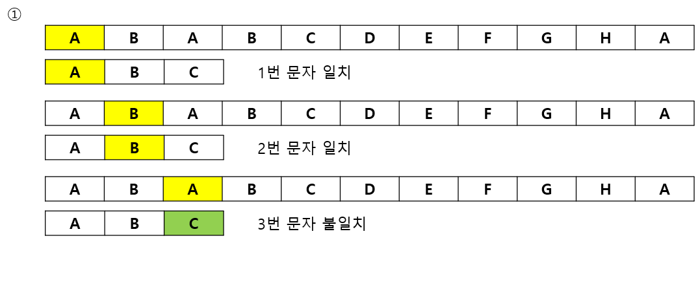
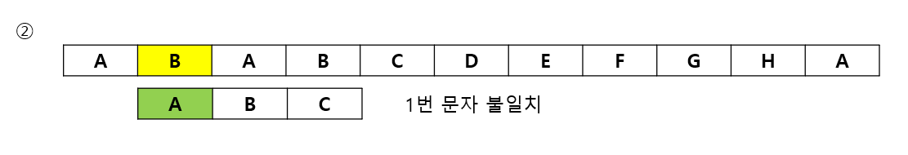
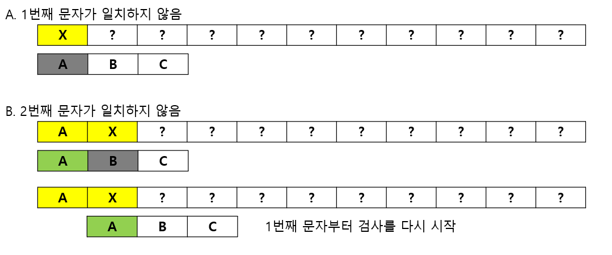
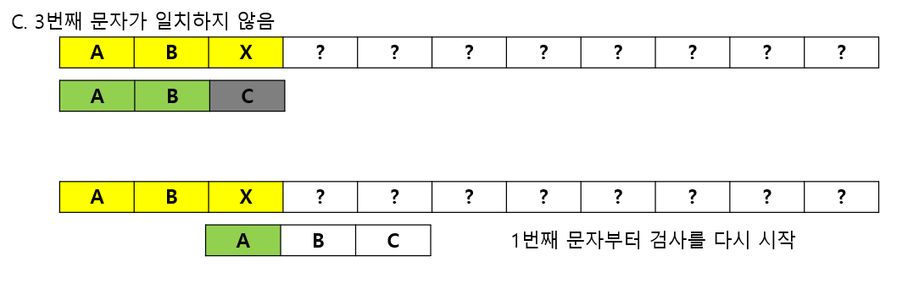
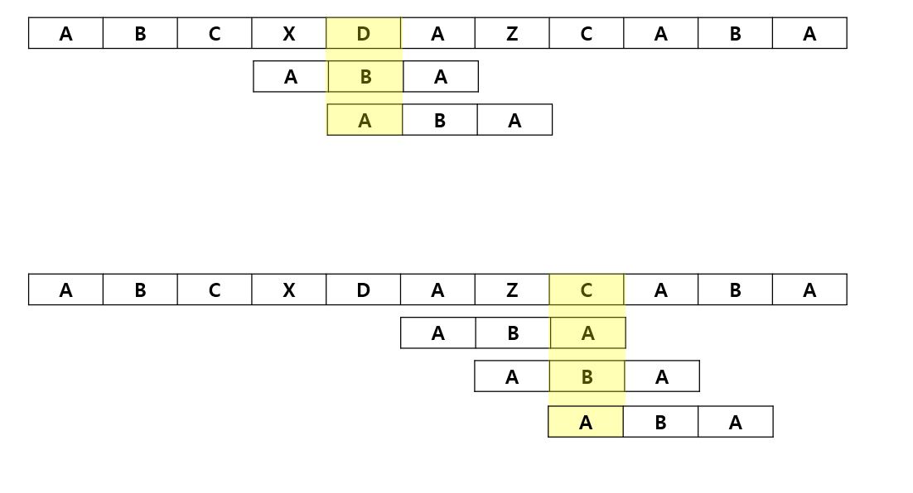

# 문자열 정렬

## 07-1 브루트-포스법

### 문자열 검색이란?

> 어떤 문자열 안에 특정 문자열이 들어 잇는지 조사하고, 들어 있다면 그 위치를 찾는 것

### 브루트-포스법 알아보기

> 브루트-포스법은 선형 검색을 확장한 단순한 알고리즘이므로 단순법, 소박법이라고도 한다.

>주어진 문제를 선형으로 구조화 한다.
> 구조화된 문제 공간을 적절한 방법으로 해를 구성할 때까지 탐색한다.
> 구성된 해를 정리한다.

#### 예제

[실습 7-1](../src/ch07/BFmatch.java)

## 07-2 KMP법

### KMP법 알아보기

> KMP법은 브루트-포스법과 달리 검사한 결과를 버리지 않고 이를 효과적으로 활용하는 알고리즘
> 

#### 예시

[실습 7-3](../src/ch07/KMPmatch.java)

## 07-3 보이어-무어법

### 보이어-무어법 알아보기

>보이어와 무어가 만든 알고리즘 KMP법보다 이론과 실제에서 모두 더 우수하다.
> 패턴의 마지막 문자부터 앞쪽으로 검사를 진행하면서 일치하지 않는 문자가 있으면 미리 준비한 표에 따라 패턴을 옮길 크기를 정한다.

> 보이어-무어 알고리즘에서도 각각의 문자를 만났을 때 패턴을 옮길 크기를 알려주는 건너뛰기 표를 미리 만들어두어야 한다.

패턴 문자열 길이가 n일 때 옮길 크기는 다음과 같은 방법으로 결정한다.

> 패턴에 들어 있지 않은 문자를 만난 경우
> 1. 패턴을 옮길 크기는 n
> 
> 패턴에 들어 있는 문자를 만난 경우
> 1. 해당 문자의 마지막 인덱스가 k이면 패턴을 옮길 크기는 n - k - 1
> 2. 패턴의 마지막 문자가 패턴 안에 중복해서 들어 있지 않은 경우 패턴을 옮길 크기를 n으로 설정

[실습 7-4](../src/ch07/BMmatch.java)

#### 문자열 검색 알고리즘의 시간 복잡도와 실용성

- 브루트-포스법
  - O(mn)이지만 , 일부러 만든 패턴이 아닌 한 실질적 복잡도는 O(n)

- KMP법
  - 최악의 경우에도 O(n) 반면, 처리가 복잡하고, 패턴 안에 반복하는 요소가 없으면 효율이 떨어진다.

- 보이어-무어법
  - 최악의 경우 O(n) 평균적으로 O(n/m). 다만 원래 알고리즘인 2개의 배열을 사용하는 방법은 배열작성시 KMP법과 마찬가지로 처리하기 복잡하다.
