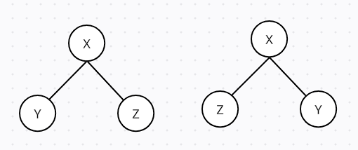
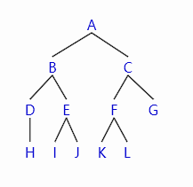
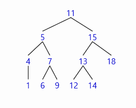

# 트리

## 09-1 트리

### 트리란?

> 데이터 사이의 계층 관계를 나타내는 자료구조
> 

#### 루트
트리의 가장 윗부분에 위치하는 노드를 루트라고 한다.
하나의 트리에는 하나의 루트만 존재한다.

#### 리프
트리의 가장 아랫부분에 위치하는 노드를 리프라고 한다.

#### 안쪽 노드
리프를 제외한 나머지 노드(루트를 포함)

#### 자식
어떤 노드에서 가지로 연결된 아래쪽 노드를 자식이라고 한다.

#### 부모
어떤 노드에서 가지로 연결된 바로 위쪽 노드를 부모라고 한다.

#### 형제
부모가 같은 노드

#### 조상
어떤 노드에서 위쪽으로 뻗어 나간 모든 노드

#### 자손
어떤 노드에서 아래쪽으로 뻗어 나간 모든 노드

#### 레벨
루트로부터 얼마나 떨어져 있는가를 나타낸 값. 루트의 레벨은 0이며, 아래로 뻗어나갈 때 마다 1씩 증가.

#### 차수
노드가 갖은 자식의 수를 차수라고 한다. 모든 노드의 차수가 n 이하인 트리를 n진 트리라고 한다.

#### 높이
루트에서 가장 멀리 떨어진 리프까지의 거리(리프 레벨의 최댓값)

#### 서브트리
트리 안에서 다시 어떤 노드를 루트로 정하고 그 자손으로 이루어진 트리

#### 널 트리
노드가 전혀 없는 트리

### 순서 트리와 무순서 트리 살펴보기

위의 두 트리는 순서 트리로 보면 다른 트리지만 무순서 트리로 보면 같은 트리라고 할 수 있다.

### 순서트리 탐색 살펴보기

순서 트리의 모드를 스캔하는 방법은 2가지.

#### 너비 우선 탐색(가로형 탐색)(Breadth First Search)

> 낮은 레벨에서 시작해 왼쪽에서 오른쪽 방향으로 따라가다가 한 레벨이 끝나면 다음 레벨로 내려간다.
> 

> 탐색 순서 : A -> B -> C -> D -> E -> F -> G -> H -> I -> J -> K -> L
> 

#### 깊이 우선 탐색(세로형 탐색)(Depth First Search)

> 리프에 이를 때까지 아래로 내려가면서 탐색. 리프에 도달해 더 이상 탐색할 곳이 없으면 부모에게 돌아간 후, 다음 자식 노드로 내려간다.

#### 전위 순회(preorder)

>노드 방문 -> 왼쪽 자식 -> 오른쪽 자식
> 
>  A -> B -> D -> H -> E -> I -> J -> C -> F -> K -> L -> G

#### 중위 순회(inorder)

> 왼쪽 자식 -> 노드 방문 -> 오른쪽 자식
> 
> H -> D -> B -> I -> E -> J -> A -> K -> F -> L -> C -> G
> 

#### 후위 순회(postorder)

> 왼쪽 자식 -> 오른쪽 자식 -> (돌아와) 노드 방문
> 
> H -> D -> I -> J -> E -> B -> K -> L -> F -> G -> C -> A
> 

---
## 09-2 이진트리와 이진검색트리

### 이진 트리란?

각 노드가 왼쪽 자식과 오른쪽 자식 둘을 갖는 트리. 

### 완전이진트리란?

루트에서 아래쪽 레벨로 내려가는 노드가 빠짐없이 채워져 있고, 또 같은 레벨에서는 왼쪽에서 오른쪽으로 노드가 빠짐없이 채워져 있는 이진트리.

>1. 마지막 레벨을 제외한 레벨은 노드를 빠짐없이 가득 채운다.
>2. 마지막 레벨은 왼쪽부터 오른쪽 방향으로 노드를 빠짐없이 채우되 반드시 끝까지 채울 필요는 ㅇ벗다.

높이가 k인 완전이진트리가 가질 수 있는 노드의 최댓값은 2^(k+1) - 1개.  따라서 n개의 노드를 저장할 수 있는 완전이진트리의 높이는 log n이다.

### 이진검색트리 살펴보기

>1. 어떤 노드 N을 기준으로 왼쪽 서브트리 노드의 모든 키값은 노드 N의 키값보다 작다.
>2. 오른쪽 서브트리 노드의 키값은 노드 N의 키값보다 크다.

같은 키값을 갖는 노드는 없다.

이 때 이진검색트리를 중위 순회하면 다음과 같이 키값의 오름차순으로 노드를 얻을 수 있다.

>1 -> 4 -> 5 -> 6 -> 7 -> 9 -> 11 -> 12 -> 13 ->14 -> 15 -> 18

이진검색트리의 특징

>- 구조가 단순한다.
>- 중위 순회를 하면 키값의 오름차순으로 노드를 얻을 수 있다.
>- 이진 검색과 비슷한 방식으로 아주 빠르게 검색할 수 있다.
>- 노드를 삽입하는 것이 쉽다.

이러한 특징 때문에 폭넓게 사용된다.

### 이진검색트리 만들기

[실습 9-1](../src/ch09/BinTree.java)

#### 노드 클래스 Node<K,V> 

다음과 같이 4개의 필드로 구성된다.

>- key : 키값(자료형 k는 임의의 자료형)
>- data : 데이터(자료형 v는 임의의 자료형)
>- left : 왼쪽 포인터(왼쪽 자식 노드를 ㄱ라르킴, 형은 Node<K,V>)
>- right : 오른쪽 포인터(오른쪽 자식 노드를 가르킴, 형은 Node<K,V>)

Node<K,V>는 1개의 생성자와 3개의 메서드를 가진다.

>- 생성자 : 각 필드에 넣어 둘 4개의 값을 전달받아 그대로 설정
>- getKey() : 키값 key를 그대로 반환하는 메서드
>- getValue() : 데이터 data를 그대로 반환하는 메서드
>- print() : 데이터를 출력하는 메서드. 출력하는 것은 data.

#### 이진검색트리 클래스 BinTree<K,V>

이진검색트리 클래스 BinTree<K,V>는 2개의 필드로 구성된다.

> root : 루트에 대한 참조를 넣어 두는 필드.
> comparator : 키값의 대소 관계를 판단하는 비교자. 이진검색트리를 생성하는 생성자에서 비교자를 명시적으로 설정하지 않으면 자동으로 null이 되도록 초기자를 null로 선언.

#### 생성자

#### 두 키값을 비교하는 메서드 comp

#### 키값으로 검색하는 메서드 search

알고리즘은 다음과 같다.

>- 루트부터 선택하여 검색을진행. 선택 노드를 p로 정의
>- p가 null이면 검색에 실패
>- 검색하는 값 key와 선택한 노드 p의 키값을 비교
>  - 값이 같으면 검색에 성공(검색 종료)
>  - key가 작으면 선택 노드를 왼쪽 자식 노드로 나아감.(왼쪽 검색)
>  - key가 크면 선택 노드를 오른쪽 자식 노드로 나아감.(오른쪽 검색)
>- 반복

#### 노드를 삽입하는 메서드 add

알고리즘은 다음과 같다.

>1. 서브트리의 루트를 선택. 여기서 선택 노드를 node라고 정한다.
>2. 삽입할 키 key와 선택 노드 node의 키값을 비교 값이 같으면 삽입에 실패
>    - key 값이 삽입할 값보다 작으면
>        - 왼쪽 자식 노드가 없으면 그곳에 노드를 삽입(종료)
>        - 왼쪽 자식 노드가 있으면 선택 노드를 왼쪽 자식 노드로 나아감.
>    - key값이 삽입할 값보다 크면
>        - 오른쪽 자식 노드가 없으면 그곳에 노드를 삽입(종료)
>        - 오른쪽 자식 노드가 있으면 선택 노드를 오른쪽 노드로 나아감.
>3. 2로 되돌아감

#### 노드를 삭제하는 메서드 remove

세 가지 경우로 나눌 수 있다.
>1. 자식 노드가 없는 노드를 삭제하는 경우
>   - 삭제하려는 노드의 부모 노드의 자신을 가리키는 포인터는 null로 업데이트하면 된다.
>2. 자식 노드가 하나인 노드를 삭제하는 경우
>   - 삭제하려는 노드의 부모 노드의 자식 포인터가 삭제하려는 노드의 자식 포인터를 가리키도록 업데이트 한다.
>3. 자식 노드가 둘인 노드를 삭제하는 경우 (부모 노드보다 값이 작은 노드를 삭제하려는 경우)
>   >1. 삭제할 노드의 왼쪽 서브트리에서 키값이 가장 큰 노드를 검색
>   >2. 검색한 노드의 데이터를 삭제 후 대상 노드로 복사
>   >3. 검색한 노드를 삭제
>   >    - 노드에 자식이 없으면
>   >       - 자식 노드가 없는 노드의 삭제 순서에 따라 노드를 삭제.
>   >    - 노드에 자식이 1개만 있으면
>   >       - 자식 노드가 1개 있는 노드 삭제 순서에 따라 노드를 삭제.

### 이진검색트리를 사용하는 프로그램 만들기

[실습9-2](../src/ch09/BinTreeTester.java)